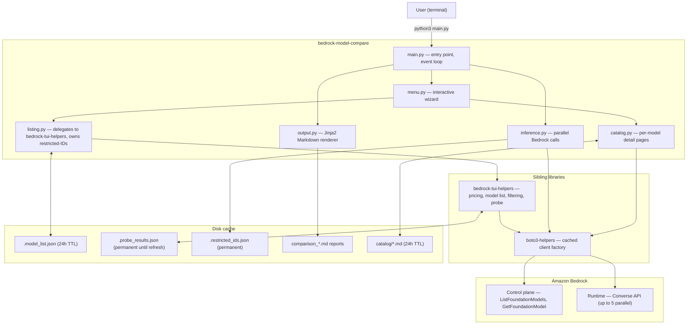
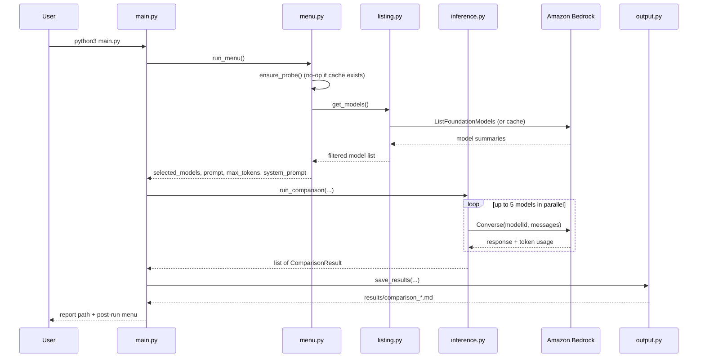
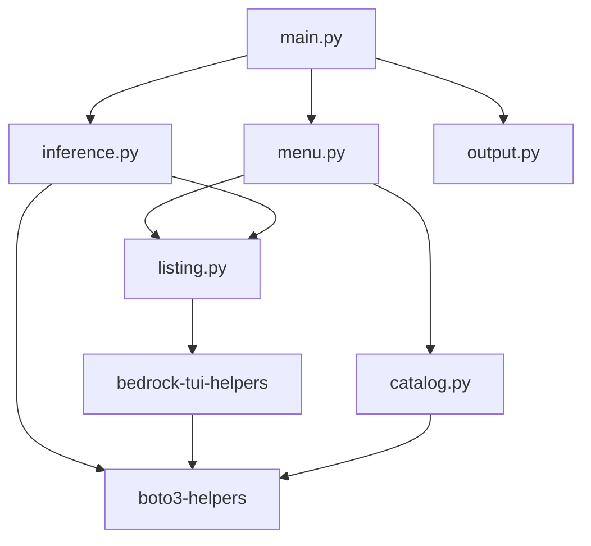

# Architecture

## Overview

bedrock-model-compare is a Python CLI that sends the same prompt to multiple Amazon Bedrock foundation models in parallel and produces a cost-sorted Markdown report. It relies on two sibling libraries:

- [boto3-helpers](../boto3-helpers/) — cached boto3 client factory and Bedrock API wrappers
- [bedrock-tui-helpers](../bedrock-tui-helpers/) — model pricing, listing, filtering, probe cache, and interactive TUI widgets

---

## System diagram

---

## Request flow

---

## Caching layers

| Cache | Location | TTL | Purpose |
|-------|----------|-----|---------|
| In-process memory | RAM | Process lifetime | Instant re-access on wizard restart |
| Model list | `.model_list.json` (via bedrock-tui-helpers) | 24 hours | Avoid repeated ListFoundationModels calls |
| Probe results | `~/.cache/bedrock-tui-helpers/.probe_results.json` | Manual refresh | Skip inaccessible models automatically |
| Restricted IDs | `results/.restricted_ids.json` | Permanent | Remember AccessDenied failures across runs |
| Catalog pages | `catalog/*.md` | 24 hours | Cache per-model GetFoundationModel detail |

---

## Module dependency graph

